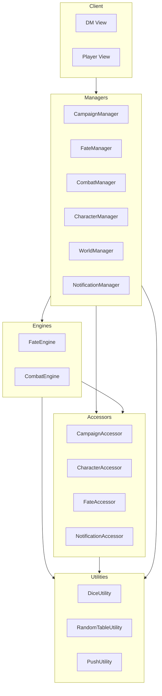
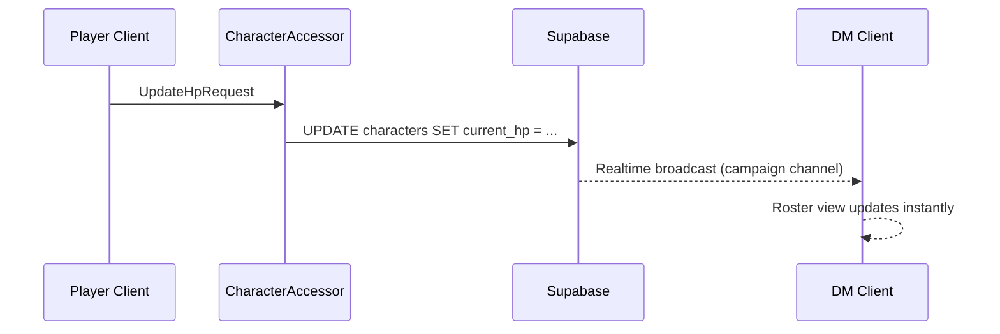
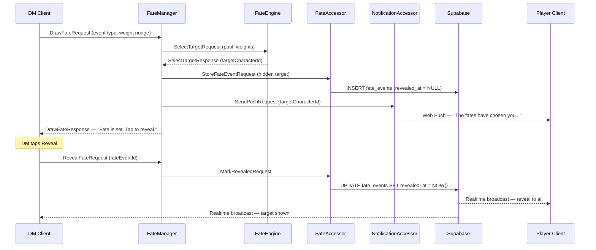

# LoreKeeper — Architecture

## Platform

**Progressive Web App (PWA)**
- No install friction — players open a link on their phone at the table
- Works on any device and OS
- Web Push API enables the Fate Engine's private player notifications

---

## Technology Stack

| Concern | Choice | Rationale |
|---|---|---|
| Frontend framework | Next.js (App Router) | SSR for initial load, API routes for server-side push signing, file-based routing |
| Hosting | Vercel | Zero-config deploys, custom domain, SSL, CD from git — built for Next.js |
| Language | TypeScript (strict) | No `any`; type guards at all external boundaries |
| Real-time sync | Supabase Realtime | HP changes, initiative, condition updates sync instantly to all clients |
| Database | Supabase (Postgres) | Relational model fits campaign/character/event data; free tier sufficient |
| Push notifications | Web Push API + VAPID | Required for Fate Engine private player notifications |
| Styling | Tailwind CSS | Utility-first; fast iteration on DM vs. player view differences |
| Testing | Vitest + Testing Library | Unit tests on Engines; integration tests on Managers |

---

## iDesign Layer Map

All code follows the iDesign volatility-based decomposition defined in the global CLAUDE.md.



---

## Layer Responsibilities

### Managers

| Manager | Responsibility |
|---|---|
| `CampaignManager` | Create campaign, generate code, handle player join/leave, DM PIN validation |
| `FateManager` | Orchestrate fate draws — select target, trigger push notification, sequence the reveal |
| `CombatManager` | Initiative order, turn advancement, HP changes, condition application/expiry |
| `CharacterManager` | Character sheet CRUD, level-up, rest resets, spell slot management |
| `WorldManager` | NPC roster, location tracking, session log, party inventory |
| `NotificationManager` | Subscribe devices, send pushes (DM whispers, fate hits, level-up alerts) |

### Engines

| Engine | Responsibility |
|---|---|
| `FateEngine` | Weighted random selection from the fate pool; pure logic, no I/O |
| `CombatEngine` | Initiative sort, turn order calculation, condition duration math |

### Accessors

| Accessor | Responsibility |
|---|---|
| `CampaignAccessor` | Supabase: campaigns table, campaign codes, DM PIN storage |
| `CharacterAccessor` | Supabase: character sheets, current HP, spell slots, conditions |
| `FateAccessor` | Supabase: fate log, cursed item assignments, pending reveals |
| `NotificationAccessor` | Web Push: VAPID key management, push subscription storage, send push |

### Utilities

| Utility | Responsibility |
|---|---|
| `DiceUtility` | Standard and custom dice rolls |
| `RandomTableUtility` | Random table lookup (names, weather, loot, encounter hooks) |
| `PushUtility` | VAPID payload construction, Web Push serialization |

---

## Key Data Models

```typescript
// Campaign
interface Campaign {
  id: string
  code: string           // e.g. "WOLF-7"
  dmPinHash: string
  createdAt: Date
  lastActiveAt: Date
  expiresAt: Date        // 90 days after lastActiveAt
}

// Player / Character
interface Character {
  id: string
  campaignId: string
  playerName: string
  characterName: string
  class: string
  level: number
  maxHp: number
  currentHp: number
  armorClass: number
  spellSlots: SpellSlot[]
  conditions: Condition[]
  pushSubscription: PushSubscription | null
  isActive: boolean
}

// Fate Event
interface FateEvent {
  id: string
  campaignId: string
  eventType: FateEventType   // 'attack' | 'curse' | 'windfall' | 'betrayal' | 'mystery'
  targetCharacterId: string  // selected by FateEngine, hidden until reveal
  revealedAt: Date | null
  dmNote: string | null
  createdAt: Date
}
```

---

## Real-time Sync Strategy

Supabase Realtime handles all live state:

- **HP changes** — broadcast to DM and all players in the campaign channel
- **Initiative / turn order** — broadcast to all
- **Fate reveal** — targeted: push notification to the chosen player first, then DM taps Reveal which broadcasts to all



---

## Fate Engine Reveal Flow



The asymmetry — player knows before DM — is the core tension mechanic.

---

## Folder Structure

```
lorekeeper/
├── app/                        # Next.js App Router pages
│   ├── dm/                     # DM views
│   └── play/                   # Player views
├── src/
│   ├── managers/
│   │   ├── campaign/
│   │   │   ├── CampaignManager.ts
│   │   │   └── handlers/
│   │   ├── fate/
│   │   │   ├── FateManager.ts
│   │   │   └── handlers/
│   │   ├── combat/
│   │   └── character/
│   ├── engines/
│   │   ├── fate/
│   │   │   ├── FateEngine.ts
│   │   │   └── handlers/
│   │   └── combat/
│   ├── accessors/
│   │   ├── campaign/
│   │   ├── character/
│   │   ├── fate/
│   │   └── notification/
│   ├── utilities/
│   │   ├── DiceUtility.ts
│   │   ├── RandomTableUtility.ts
│   │   └── PushUtility.ts
│   ├── common/
│   │   ├── RequestBase.ts
│   │   ├── ResponseBase.ts
│   │   └── resolver/
│   │       ├── IHandler.ts
│   │       ├── HandlerResolver.ts
│   │       └── HandlerResolverBuilder.ts
│   └── container/
│       └── DependencyContainer.ts
└── public/
    └── sw.js                   # Service worker for Web Push
```
