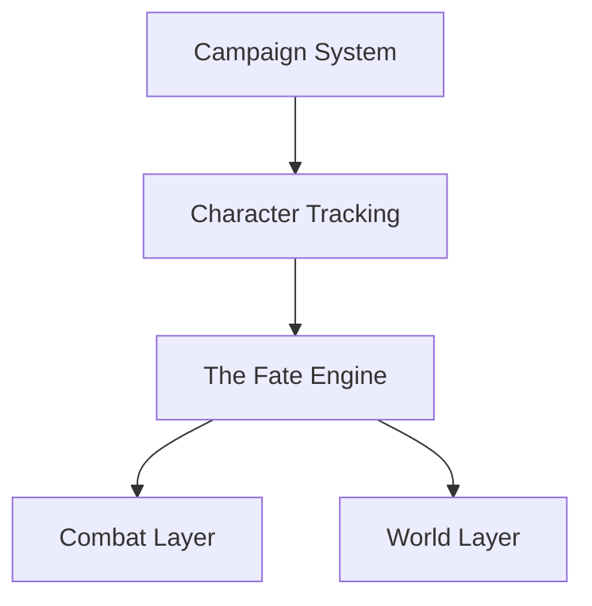

# LoreKeeper — Feature Plan

## Vision

A web-based DM companion app. No accounts — players join a campaign by code. The flagship feature is the **Fate Engine**: a deliberate "fog of fate" mechanic where even the DM doesn't know who a random event targets until the dramatic reveal.

---

## Dependency Chain

---

## Phase 1 — Foundation

*Required for everything else.*

| Feature | Notes |
|---|---|
| Campaign creation | DM gets a short human-readable code (e.g. `WOLF-7`) |
| Player join flow | Enter code → set name + character class → you're in |
| No accounts | Identity is campaign code + device. DM has a PIN to reclaim their session |
| Character record | Name, class, level, max HP, current HP, AC, spell slots |
| Campaign roster | DM sees all players, their status, and current HP at a glance |

---

## Phase 2 — The Fate Engine

*The flagship feature. The DM sets intent; the app picks the target; neither knows the outcome until the reveal.*

| Feature | Notes |
|---|---|
| Fate pool | All active characters are in the pool by default. DM can exclude individuals |
| Weighted fate | DM can nudge weights — e.g. "someone in danger" makes lower-HP characters more likely targets |
| Blind draw | DM picks an event type (attack, curse, windfall, betrayal, mystery) — app selects target secretly |
| The Reveal | DM taps Reveal. App animates the reveal to build tension before showing the target |
| Player push notification | When fate lands on a player, their device gets a private push notification before the reveal — they know, the DM doesn't yet |
| Cursed item assignment | App silently assigns a cursed item to whoever picked it up. DM gets a private notification |
| "Anyone" events | "Someone gets a vision" — app picks secretly, sends a push notification to that player only |
| Fate log | Every fate event logged: timestamp, event type, target, DM's note |

---

## DM Control Panel

The DM campaign view is a single unified screen — not separate pages for each feature. It consolidates everything the DM needs at the table into one place, organized into sections or tabs:

| Section | What's there |
|---|---|
| **Roster** | All characters — HP bars, conditions, AC, real-time sync |
| **Combat** | Initiative order, active turn indicator, round counter, HP adjustments |
| **Fate Engine** | Draw fate, set weights, Reveal button, fate log |
| **World** | Quick-access NPC notes, session log (Phase 4) |

The Roster section exists today (Phase 1). Each subsequent phase plugs into this panel rather than creating new pages.

---

## Phase 3 — Combat Layer

| Feature | Notes |
|---|---|
| Initiative tracker | Roll order, whose turn it is, round counter |
| HP management | DM or player updates HP; changes sync to DM in real time |
| Conditions | Poisoned, stunned, charmed, etc. — with round countdown |
| Death saves | Tracked privately per player; DM sees all |
| Spell slots / abilities | Per-player, reset on short or long rest |

---

## Phase 4 — World Layer

| Feature | Notes |
|---|---|
| NPC roster | Name, faction, relationship to each player, last location, DM-only secrets |
| Location tracker | Visited/unvisited toggle, DM notes per location |
| Party inventory | Shared gold, shared items, individual loot |
| Session log | Auto-timestamped DM notes per session; exportable |

---

## Phase 5 — Polish & Power Features

| Feature | Notes |
|---|---|
| Random tables | Built-in tables: names, weather, encounter hooks, loot. Fully customizable |
| DM whisper | Push a secret message to one specific player's device |
| Quick dice roller | Standard + custom dice with per-session roll history |
| XP pool | DM awards XP; players notified automatically on level-up |
| Campaign persistence | Campaigns survive browser close; expire after 90 days of inactivity |

---

## Key Decisions

- **Fate Engine reveal is push-notification based.** The targeted player's phone buzzes privately before the DM sees the result. This makes the secret asymmetric — the player knows they were chosen, the DM doesn't yet.
- **No accounts.** Campaign code is the session key. DM PIN protects DM-only actions. Player identity is tied to the device within a campaign.
- **PWA.** Players open a link on their phone at the table — no install required. PWA enables Web Push notifications.
